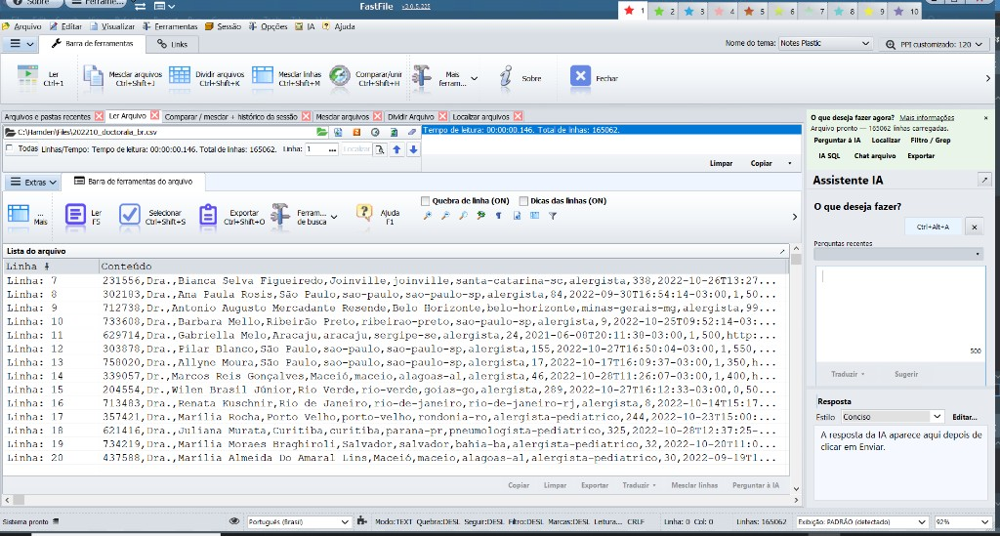

# FastFile

**Open, search and edit multi-gigabyte text files instantly on Windows.**

FastFile is a native Windows desktop tool written in Delphi for working with very large text files
(logs, CSV/TSV exports, SQL dumps, data extracts) that make ordinary editors freeze or run out of memory.
Files are indexed by line and read through memory-mapped I/O, so a 10 GB file opens and scrolls as
smoothly as a 10 KB one.



## Features

- **Huge files, instantly** – line index + memory-mapped files (MMF); *Zero Scan* mode opens giant files without a full pre-scan.
- **Search and replace** – fast find, filters, Replace All in segmented mode for files larger than RAM.
- **Edit safely** – line editing, batch delete, atomic writes (temp file + swap) and a session history journal.
- **File tools** – split, merge, compare (line diff engine) and extract parts of a file.
- **Navigation** – bookmarks, go to line, filtered views, zoom.
- **Python macros** – run scripts against the open file through the built-in script engine.
- **AI assistant** – ask questions about the file content (optional Python companion).
- **AI agent on files** (Ctrl+Alt+G) – describe a request in plain words or SQL (`SELECT … GROUP BY / SUM / COUNT`, `UPDATE`, `DELETE`…) over one or many files; every change is shown as a proposal and only written after you accept it, within a configurable time limit.
- **Anonymize data** (Ctrl+Alt+D) – replace private values with fake ones of the same type and length, with preview and undo.
- **Session history details** – before/after of every change, field-by-field compare, export to TXT/CSV/JSON.

Current version: **3.0.5.232** — see [src/CHANGELOG_IMPLEMENTACOES.md](src/CHANGELOG_IMPLEMENTACOES.md).
- **14 languages** – English, Português (BR/PT), Español, Français, Deutsch, Italiano, Polski, Română, Magyar, Čeština, 日本語, 简体中文, 繁體中文.
- **Skinnable UI** – AlphaSkins themes and adjustable UI scaling (PPI) for high-DPI monitors.

## Requirements

| Item | Details |
|------|---------|
| OS | Windows 7 or later (Win64 recommended; Win32 also supported) |
| IDE | Embarcadero Delphi 10.4.2 Sydney (`src/FastFile.dproj`). Legacy Delphi 7 build is still kept (`src/FastFile.dpr`). |
| AlphaControls | Commercial VCL suite – **not included** in this repository. Expected at `..\..\acnt_reg` relative to `src` (see `DCC_UnitSearchPath` in the project). Get it from [alphaskins.com](https://www.alphaskins.com/). |
| FindFile | Component expected at `..\..\Findfile` relative to `src`. |
| FastMM4 / FastCode | Included (`src/FastMM4-master`, `src/FastCode.Libraries-0.6.4`). |

## Building

1. Install AlphaControls and make sure the paths above resolve (or adjust the unit search path in the project options).
2. Open `src/FastFile.dproj` in Delphi 10.4.2.
3. Select platform **Win64** (or Win32) and build.
4. The executable is written to `src/Build/<Platform>/FastFile.exe`.

Command-line build:

```bat
call "C:\Program Files (x86)\Embarcadero\Studio\21.0\bin\rsvars.bat"
cd src
msbuild FastFile.dproj /t:Build /p:Config=Release /p:Platform=Win64
```

On first run FastFile extracts its default configuration (`ASkin.ini`), skins and assets from embedded
resources into the executable folder.

## Repository layout

| Path | Contents |
|------|----------|
| `src/` | Delphi sources, forms, resources and the project files |
| `src/README.md` | Detailed technical documentation (architecture, threading, indexing, INI keys, AI plugins) |
| `Skins/` | AlphaSkins themes |
| `Images/`, `Resources/` | Icons and image assets |
| `Docs/` | Notes and documentation |
| `tools/` | Helper scripts (i18n, encoding maintenance) |

## Documentation

See **[src/README.md](src/README.md)** for in-depth technical documentation: core units, threading model,
index file format, Zero Scan decision logic, atomic writes, diff engine, internationalization and
configuration keys.

## License

See [src/LICENSE](src/LICENSE).

Copyright © 2025–2026 Hamden Vogel.
