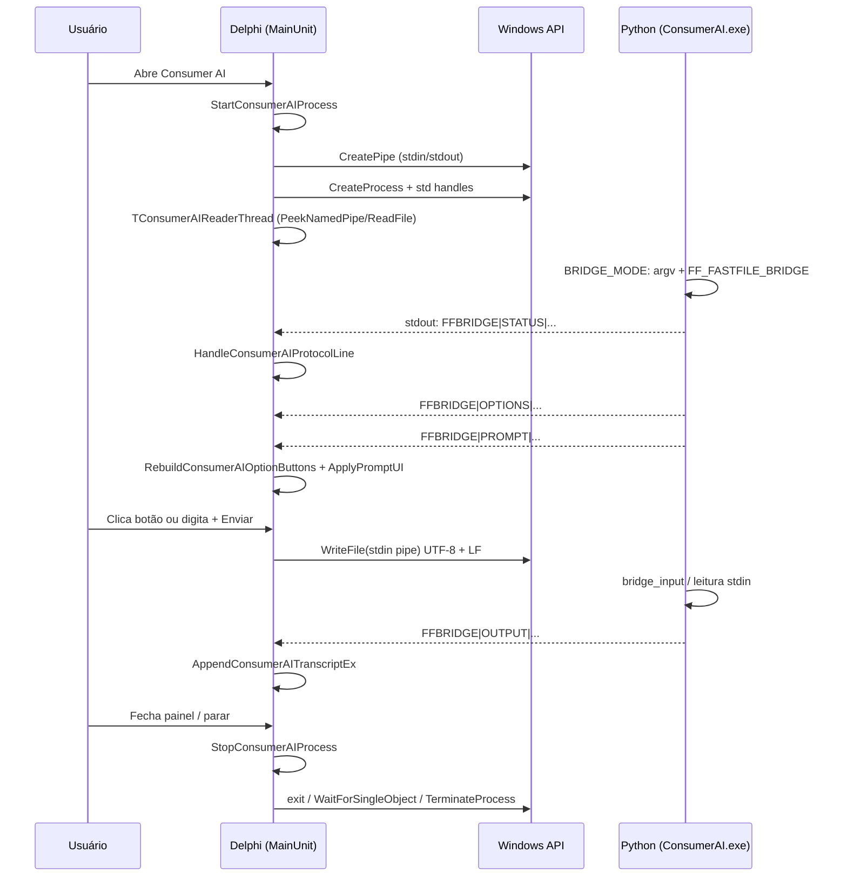

# Comunicação Delphi ↔ Python (Consumer AI / FastFile)

Este texto explica **em ordem cronológica** o que acontece quando você usa o painel **Consumer AI**: quem executa cada passo (**Delphi** ou **Python**), **quais funções** entram em cena e **por quê**.

---

## Ideia central (uma frase)

- **Delphi** cria o processo Windows, monta **pipes** (stdin/stdout), lê a saída em **thread** e desenha a **interface** (transcript, status, campo de texto, botões dinâmicos).
- **Python** (no `ConsumerAI.exe`) roda a lógica do motor (LanceDB/DuckDB/IA), escreve **linhas de protocolo** no stdout e lê **respostas do usuário** no stdin — no modo integração isso passa por funções de *bridge* em vez de um terminal real.

Ninguém “abre um socket”: a comunicação é **só texto em pipes**, uma linha por vez (ou quase), prefixada quando for comando estruturado para a UI.

---

## Arquivos que você precisa olhar

| Papel | Arquivo |
|--------|---------|
| Host (processo, pipes, UI, protocolo) | `Src/MainUnit.pas` |
| Motor + protocolo `FFBRIDGE` | `Src/data-lake-duckdb-main/ConsumerAI_LanceDB.py` |
| Textos / idiomas do host | `Src/uI18n.pas` |

Executável esperado ao lado do FastFile: **`ConsumerAI.exe`** (resolvido em `ResolveConsumerAIScriptPath`).

---

## Protocolo em uma linha (o que trafega no pipe)

Linhas que **comandam a UI** seguem o formato:

```text
FFBRIDGE|<TIPO>|<conteúdo>
```

O prefixo **`FFBRIDGE|`** é fixo por compatibilidade entre as duas pontas. A linha de comando ainda pode usar **`--bridge`** e/ou a variável de ambiente **`FF_FASTFILE_BRIDGE=1`** (o Delphi define essa variável ao subir o processo para o Python detectar o modo mesmo se o parser de argv falhar).

**Tipos** que o Delphi trata em `HandleConsumerAIProtocolLine` (resumo):

| TIPO | Quem envia | O que o Delphi faz |
|------|------------|---------------------|
| `STATUS` | Python | Atualiza o rótulo de status (`SetConsumerAIStatus`). |
| `PROMPT` | Python | Guarda o último prompt, opcionalmente mostra no transcript, habilita entrada (`ApplyPromptUI`). |
| `OPTIONS` | Python | Monta botões de atalho a partir de uma lista CSV (`RebuildConsumerAIOptionButtons`). |
| `OUTPUT` | Python | Acrescenta texto ao transcript como saída “normal” do motor. |
| `ERROR` | Python | Mostra erro no transcript e ajusta status. |

Qualquer texto **sem** o prefixo `FFBRIDGE|` pode ainda aparecer no transcript como saída “livre” do Python (após regras de supressão em `ShouldSuppressConsumerAIOutput`).

---

## Passo a passo (Delphi faz … depois Python faz …)

### Passo 1 — Usuário pede para abrir o Consumer AI

**Delphi**

- Disparo: botão da barra (`btnConsumerAIClick`) ou menu (`miConsumerAIClick`).
- Chama rotinas como `EnsureConsumerAIPanel` / `ShowConsumerAIPanel` para existir o painel (memo, status, input, área de botões).
- Em seguida chama **`StartConsumerAIProcess`** (é aqui que o processo nasce).

**Por quê:** a UI precisa existir antes de mostrar mensagens; o processo externo só deve subir com arquivo válido.

---

### Passo 2 — Delphi valida e monta a linha de comando

**Delphi** (`StartConsumerAIProcess`)

- Lê o arquivo atual em `edtFileName.Text`; se estiver vazio ou inexistente, mostra mensagem e **não** cria processo.
- Resolve o caminho do EXE com **`ResolveConsumerAIScriptPath`** (pasta do FastFile + `ConsumerAI.exe`).
- Monta a **command line** típica (simplificado):  
  `ConsumerAI.exe -file "<arquivo>" -rp -prompt --bridge`  
  (o fonte real está em `MainUnit.pas` com aspas e flags exatas).
- Define **`FF_FASTFILE_BRIDGE=1`** com `SetEnvironmentVariable` **só durante** o `CreateProcess`, para o Python ativar o modo bridge mesmo se `--bridge` não aparecer em `sys.argv` como esperado.

**Por quê:** um único EXE empacotado pode ser iniciado por launchers que alteram argv; a env var é um “plano B” documentado no próprio `ConsumerAI_LanceDB.py`.

---

### Passo 3 — Delphi cria pipes e o processo Windows

**Delphi** (`StartConsumerAIProcess`)

- Preenche **`TSecurityAttributes`** e chama **`CreatePipe`** duas vezes:
  - um pipe para **stdout** do filho (Delphi fica com a ponta de **leitura**);
  - um pipe para **stdin** do filho (Delphi fica com a ponta de **escrita**).
- Usa **`SetHandleInformation`** para o filho **não herdar** handles que o Delphi ainda precisa na sua ponta.
- Monta **`TStartupInfo`** com `STARTF_USESTDHANDLES`: `hStdInput` / `hStdOutput` / `hStdError` apontam para as pontas corretas do pipe (stderr costuma ir junto do stdout para o Delphi ver erros no mesmo fluxo).
- Chama **`CreateProcess`** com `CREATE_NO_WINDOW` (sem console próprio) e `SW_HIDE`.

**Por quê:** pipes são o jeito mais simples no Win32 de ter **stdin/stdout** entre processo pai e filho sem arquivo temporário; esconder a janela evita flicker de console.

---

### Passo 4 — Delphi inicia a thread leitora

**Delphi**

- Marca `FConsumerAIProcessRunning`, guarda o arquivo ativo, zera `FConsumerAILastPrompt` se for caso.
- Cria **`TConsumerAIReaderThread`**, passando o handle de leitura do stdout do pipe.

**Por quê:** ler o pipe **bloqueia** ou precisa de polling; fazer isso na thread principal congelaria a janela do Delphi 7.

---

### Passo 5 — Python sobe, detecta modo bridge e substitui o “console”

**Python** (`ConsumerAI_LanceDB.py`)

- **Detecção do modo:** `_detect_early_bridge_mode()` (início do ficheiro) lê `sys.argv` e a variável de ambiente `FF_FASTFILE_BRIDGE`; o resultado fica em **`EARLY_BRIDGE_MODE`**, depois **`BRIDGE_MODE`**. Constante global **`BRIDGE_PREFIX = "FFBRIDGE|"`**.
- **Arranque em `BRIDGE_MODE`:** o bloco `if BRIDGE_MODE:` (por volta da linha 753 do ficheiro) faz três coisas importantes:
  1. **`console = BridgeConsole()`** — objeto que **substitui** o `Console` Rich normal: `print`/`rule`/`status` viram chamadas a **`bridge_emit("OUTPUT", ...)`** etc. (ver classe abaixo).
  2. **`builtins.input = bridge_input`** — **todo** `input()` do programa passa a ser **`bridge_input(...)`** sem alterar cada chamada manualmente.
  3. **`bridge_emit("STATUS", "Bridge mode enabled")`** — primeira linha de protocolo no stdout.

**Por quê:** o motor já usa `input()` e saída estilo consola; o bridge redireciona isso para **linhas de protocolo** + **stdin** que o Delphi controla.

---

### Passo 6 — Python envia a primeira “onda” de mensagens

**Python** — funções reais no `ConsumerAI_LanceDB.py`

| Função / classe | O que faz |
|-----------------|-----------|
| **`bridge_emit(kind, text="")`** | Se `BRIDGE_MODE`, sanitiza o texto (`_bridge_sanitize_text`), parte em linhas e escreve no **`sys.stdout`** uma ou mais linhas `FFBRIDGE|<kind>|<linha>\n`, com **`sys.stdout.flush()`**. |
| **`bridge_input(prompt="", merge_options=None)`** | Monta a lista de opções: começa com **`_extract_options_from_prompt(prompt)`**, junta tokens extras válidos de **`merge_options`**, depois **`bridge_emit("OPTIONS", ",".join(options))`**, **`bridge_emit("PROMPT", prompt)`**, e **bloqueia** em **`sys.stdin.readline()`** até o Delphi enviar uma linha no pipe de stdin. |
| **`bridge_input_with_choices(prompt, *choice_tokens, extra_merge=())`** | Chama **`bridge_normalize_choice_tokens`** e delega em **`bridge_input(..., merge_options=...)`** quando as opções vêm explícitas (submenus), não só do texto do prompt. |
| **`bridge_normalize_choice_tokens(*tokens)`** | Normaliza tokens `^[a-z0-9]{1,5}$` únicos para a lista enviada em `OPTIONS`. |
| **`_extract_options_from_prompt(prompt_text)`** | Regex sobre o texto do prompt (grupos `(...)`, `(x)palavra`, etc.) para inferir atalhos clicáveis. |
| **`get_valid_input_choices(prompt, choices, **kwargs)`** | Encaminha para **`get_valid_input`** com `merge_options` derivados de `choices` (atalho para código legado). |
| **`BridgeConsole`** | Classe que delega em Rich **`Console(..., file=io.StringIO())`**: **`print`** captura o render e chama **`bridge_emit("OUTPUT", ...)`**; **`status`** → `bridge_emit("STATUS", ...)`; **`input`** → **`bridge_input`** (remove `[...]` do prompt Rich antes). |

Durante menus e fluxos, o código chama **`bridge_emit`** / **`bridge_input`** / **`bridge_input_with_choices`** / **`get_valid_input_choices`** conforme o caso; a saída típica inclui `STATUS`, `OPTIONS`, `PROMPT`, `OUTPUT` (e `ERROR` quando existir tratamento que emita esse tipo).

**Por quê:** **`OPTIONS` antes do `PROMPT`** (ordem dentro de `bridge_input`) permite ao Delphi desenhar os botões **antes** de mostrar o texto da pergunta; **`merge_options`** junta opções fixas do Python (tuplas `BRIDGE_MERGE_*` no mesmo ficheiro) ao que foi inferido do texto.

---

### Passo 7 — Delphi lê bytes do pipe e monta linhas

**Delphi** (`TConsumerAIReaderThread.Execute`)

- Em loop até `Terminated`:
  - Usa **`PeekNamedPipe`** para saber se há byte disponível **sem** ficar bloqueado para sempre.
  - Se não houver dados, dá um **`Sleep(100)`** e, se já existe texto acumulado no buffer mas **nada novo chegou por alguns ciclos**, pode despachar o buffer como uma “linha” mesmo **sem** `\n` final — isso cobre o caso em que o Python mandou um prompt **sem** quebra de linha no fim (o Delphi precisa mostrar o prompt antes do usuário responder).
  - Quando lê byte a byte e encontra **`#10` (LF)**, fecha a linha, converte UTF-8 → texto da UI com **`MultiByteToWideChar` / `WideCharToMultiByte`** (`Utf8AnsiToAcp` no fonte) e chama **`Synchronize(DispatchLine)`**.
- **`DispatchLine`** chama **`TfrmMain.HandleConsumerAIProtocolLine`** na **thread da UI** (requisito do VCL: não mexer em `TEdit`/`TRichEdit` a partir da worker thread).

**Por quê:** `Synchronize` evita corrida com o paint do Windows; `PeekNamedPipe` + timeout curto evita travar a UI e ainda permite prompts “sem newline”.

---

### Passo 8 — Delphi interpreta cada linha e atualiza o painel

**Delphi** (`HandleConsumerAIProtocolLine`)

- Se a linha contém **`FFBRIDGE|`**, faz parse de `TIPO` e `Payload` (texto após o segundo `|`).
- Ramifica por `OUTPUT`, `OPTIONS`, `PROMPT`, `STATUS`, `ERROR` (ver tabela acima).
- Para **`PROMPT`**, usa **`ApplyPromptUI`**: atualiza estado, transcript se pedido, habilita o campo e o fluxo de “aguardando entrada”.
- Se vier **`PROMPT`** mas faltar **`OPTIONS`**, o Delphi ainda pode **`ExtractConsumerAIOptionsFromPrompt`** para **inferir** botões a partir do texto (fallback).
- Textos visíveis passam por **`Tr` / `TrText`** (`uI18n.pas`) em pontos específicos (ex.: “conectado”, mensagens de arranque).

**Por quê:** o Delphi é só “vitrine + teclado”; quem manda no **fluxo** da conversa no modo bridge é o **roteiro Python**, expresso nessas linhas.

---

### Passo 9 — Usuário responde (teclado ou botão dinâmico)

**Delphi**

- **Botão dinâmico:** `ConsumerAIOptionButtonClick` → **`ConsumerAIWriteLine`** com o rótulo da opção (ex.: `y`, `1`, `n`).
- **Campo + Enviar:** `ConsumerAISendClick` → valida texto → **`ConsumerAIWriteLine`** com o que foi digitado.
- **`ConsumerAIWriteLine`** faz **`UTF8Encode`** da string, acrescenta **`#10`**, e grava na ponta de escrita do stdin com **`WriteFile`**.

**Por quê:** o Python do outro lado lê stdin **por linhas**; o LF é o delimitador natural. UTF-8 alinha com o que o script espera hoje.

---

### Passo 10 — Python recebe a linha e continua o roteiro

**Python**

- Quem estava à espera era **`bridge_input`**: após os `bridge_emit` de `OPTIONS` e `PROMPT`, a execução fica em **`sys.stdin.readline()`**. A linha que o Delphi escreveu no pipe (com LF) é devolvida **sem** `\r\n` final.
- Se o stdin fechar sem dados, **`bridge_input`** pode levantar **`EOFError("Bridge stdin closed")`**.
- Depois da resposta, o fluxo do programa (menus, SQL, IA, etc.) continua e volta a usar **`bridge_emit`** / **`bridge_input`** / **`BridgeConsole.print`** — ou seja, volta ao **Passo 6** em termos de protocolo.

**Assim o ciclo fecha** até o usuário encerrar ou ocorrer erro.

---

### Passo 11 — Usuário fecha a sessão (ou erro fatal)

**Delphi** (`StopConsumerAIProcess`)

- Se o processo ainda está rodando, tenta mandar **`exit`** com **`ConsumerAIWriteLine`** (o Python reconhece comandos de saída nos fluxos de menu).
- **`WaitForSingleObject`** no handle do processo; se estourar o tempo, **`TerminateProcess`** como último recurso.
- Fecha handles de pipe, termina a **`TConsumerAIReaderThread`** (`Terminate`, `WaitFor`, `Free`), fecha thread/hProcess do `PROCESS_INFORMATION`.

**Por quê:** sem isso ficam handles zumbis e processo órfão; o FastFile precisa voltar a um estado limpo para uma nova sessão.

---

## Referência rápida — onde está no Python

Tudo abaixo está em **`Src/data-lake-duckdb-main/ConsumerAI_LanceDB.py`** (números de linha são aproximados e podem mudar com commits).

| Símbolo | Linha ~ | Papel |
|---------|---------|--------|
| `_detect_early_bridge_mode` / `EARLY_BRIDGE_MODE` | ~16–25 | Detecção precoce de `--bridge` / env. |
| `BRIDGE_MODE`, `BRIDGE_PREFIX` | ~128–129 | Liga/desliga protocolo; prefixo textual `FFBRIDGE` + `\|` no stdout. |
| `_bridge_sanitize_text` | (antes de `bridge_emit`) | Texto seguro para ANSI / stdout. |
| **`bridge_emit`** | ~260 | Única função central que escreve `FFBRIDGE|tipo|...` no stdout. |
| **`BridgeConsole`** | ~278 | Substitui o `Console` Rich em modo bridge. |
| **`bridge_input`** | ~405 | `OPTIONS` + `PROMPT` + `sys.stdin.readline()`. |
| **`_extract_options_from_prompt`** | ~328 | Infere tokens a partir do texto do prompt. |
| **`bridge_input_with_choices`** | ~448 | `bridge_input` com lista explícita de opções. |
| **`bridge_normalize_choice_tokens`** | ~424 | Normalização de tokens para `OPTIONS`. |
| **`get_valid_input_choices`** | ~458 | Atalho para `get_valid_input` com `merge_options`. |
| `if BRIDGE_MODE:` + `console` + `builtins.input` | ~753–756 | Liga `BridgeConsole` e substitui `input` globalmente. |

---

## Diagrama (visão geral)



---

## Glossário rápido

| Termo | Significado |
|--------|-------------|
| Pipe | Canal de bytes entre dois processos (aqui: stdin/stdout). |
| `FFBRIDGE|` | Prefixo de **linhas de controle** para a UI do Delphi. |
| `--bridge` / `FF_FASTFILE_BRIDGE` | Sinalizadores de **modo integrado** com o FastFile. |
| `Synchronize` | No Delphi, agenda código para rodar na **thread da interface**. |

---

## Observação sobre o nome “bridge”

Nos textos **voltados ao usuário** no Delphi, a preferência tem sido evitar jargão (“bridge”) e falar em **sessão** / **entre aplicações**, mas no **protocolo e flags** os identificadores **`FFBRIDGE`** e **`--bridge`** permanecem por **compatibilidade técnica** entre o EXE Python e o host Delphi.
