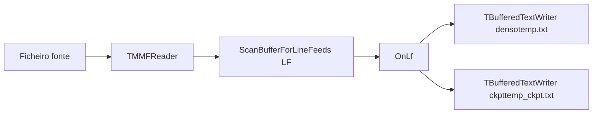

# FastFile — Indexação na abertura (F5): TMMFReader + TBufferedTextWriter

**Documento de arquitetura / referência de implementação**  
Versão de referência: **`3.0.5.225`** (Delphi 10.4.2 Win64 / Win32)  
Unidades principais: `uSmoothLoading.pas` (`TReadFileThread`), `uMMF.pas`, `UnBufferedTextWriter.pas`, `uLineIndexScan.pas`  
Constantes: `UnConsts.TEMPFILE` / `TEMP_CKPT_FILE`, `INDEX_RECORD_SIZE` / `INDEX_RECORD_BYTES = 20`

> **Documentos relacionados**  
> - [README.md](README.md) — política de abertura / Zero Scan  
> - [DOC_ZS_ATALHOS.md](DOC_ZS_ATALHOS.md) §14 — SWAR / ficheiros > 2 GB  
> - [fastfile_arquitetura_bigdata.md](fastfile_arquitetura_bigdata.md) — Zero Scan vs indexado  
> - [ARQUITETURA_TECNICA_FASTFILE.md](ARQUITETURA_TECNICA_FASTFILE.md) §5–6 — visão geral (ver correção do formato do registo abaixo)

---

## 1. Objetivo

Descrever o que acontece na **leitura indexada** (F5 / Ler / `BeginRead` → `TReadFileThread`) quando o FastFile **constrói o índice de linhas** do ficheiro fonte (ex.: `PASSIVO_....TXT`):

| Classe | Função na abertura (F5) |
|--------|-------------------------|
| **`TMMFReader`** | Lê o ficheiro fonte mapeado em memória e varre os bytes à procura de **LF** (`#10`) |
| **`TBufferedTextWriter`** | Grava os índices (`temp.txt`, `temp_ckpt.txt`) — **um registo de 20 bytes por offset** |

Fluxo resumido:

```
Ficheiro fonte  →  TMMFReader (leitura)  →  scan LF  →  TBufferedTextWriter  →  temp.txt / temp_ckpt.txt
```

**Leitura do fonte → continua `TMMFReader`.**  
**Escrita do índice → continua `TBufferedTextWriter`.**  
**MMF lê o arquivo → writer grava os offsets.**

---

## 2. Quem dispara o caminho

| Entrada | Thread / unidade |
|---------|------------------|
| **F5** / botão Ler / `DoRead` / `BeginRead` (modo indexado) | `TReadFileThread.Execute` em `uSmoothLoading.pas` |
| Reindex após edição / indexação sob demanda (Zero Scan) | Mesma `TReadFileThread` (flags `FZeroScanOnDemandIndex`, etc.) |

**Não passa por este fluxo** (abertura instantânea sem índice):

- **Force Zero Scan** activo, ou
- ficheiro ≥ limiar `MaxBytesFileIndexed` (política *Auto* / instantâneo),

quando `MainUnit` abre sem lançar `TReadFileThread` (só `finishFileNameRead`). Nesses casos não há construção imediata de `temp.txt` / `temp_ckpt.txt`.

---

## 3. Papel de cada classe

### 3.1 `TMMFReader` (`uMMF.pas`)

- Abre o ficheiro fonte com **memory-mapped file** (janelas deslizantes / `PtrAt`).
- **Não** carrega o ficheiro inteiro numa `TStringList`.
- Na indexação F5, o loop em `TReadFileThread.Execute` obtém regiões contíguas e chama `ScanBufferForLineFeeds` (`uLineIndexScan.pas`):
  - scan **SWAR** (8 bytes);
  - caminho wide **32 bytes** se a CPU tiver **AVX2**.
- Cada LF encontrado invoca o callback `OnLf`, que incrementa `totalLines` e pede escrita de offset ao writer.

### 3.2 `TBufferedTextWriter` (`UnBufferedTextWriter.pas`)

Apesar do nome do ficheiro da unit (`UnBufferedTextWriter`), a classe pública é **`TBufferedTextWriter`**.

Responsabilidades na abertura:

| Destino | Conteúdo |
|---------|----------|
| **`temp.txt`** (`TEMPFILE`) | Índice **denso**: um offset por linha (quando construído) |
| **`temp_ckpt.txt`** (`TEMP_CKPT_FILE`) | Índice **esparso**: um offset a cada `CKPT_INTERVAL` (1024) linhas (+ offset inicial) |

Características do writer:

- Buffer interno configurável; **default do construtor = 4 MB** (`4194304`).
- No F5 típico (`TReadFileThread`):
  - índice denso: frequentemente **16 MB**;
  - ckpt: tipicamente **8 MB** (até **32 MB** em modo só-ckpt).
- API de índice: **`WriteOffsetDirect(Value: Int64)`** — enfileira offsets e descarrega em lote (`OFFSET_QUEUE_CAPACITY = 65536`).
- **Não** usa `Format` / `string` por linha para montar o registo; dígitos ASCII são escritos directamente no buffer (`WriteOffsetRecordAt`).

Comentário no código (intent):

> Escreve o offset diretamente no buffer sem usar Format ou alocar strings.

---

## 4. Formato do registo (20 bytes)

Constantes: `INDEX_RECORD_SIZE` / `INDEX_RECORD_BYTES = 20`.

| Bytes | Conteúdo |
|-------|----------|
| 0..17 | Offset da linha em ASCII (espaços à esquerda; pode incluir `-` se negativo) |
| 18 | `#13` (CR) |
| 19 | `#10` (LF) |

**Não** é um registo binário `Int64 + Int64 + flags`. É uma linha de texto de largura fixa com o **offset 1-based** (posição de início da linha no ficheiro fonte).

Leitura tipica noutros sítios: `Seek((LineNum - 1) * 20)`, `Read` 18 bytes, `StrToInt64Def(Trim(...))`.

O mesmo formato aplica-se a `temp.txt` e a `temp_ckpt.txt`.

---

## 5. Fluxo detalhado (modo indexado normal, &lt; 2 GB)

```
1. Apaga temp.txt / temp_ckpt.txt (e meta) da pasta do exe
2. Cria TBufferedTextWriter para temp.txt (denso) e temp_ckpt (via ficheiro temp + rename)
3. Escreve offset inicial = 1 (início da 1.ª linha) em ambos (se ficheiro não vazio)
4. TMMFReader.Create(fonte)
5. Enquanto AbsOffset < FileSize:
     PtrAt → ScanBufferForLineFeeds → OnLf
       OnLf:
         totalLines++
         IdxW.WriteOffsetDirect(LfPos + 2)     // início da próxima linha
         a cada 1024 linhas: CkptW.WriteOffsetDirect(...)
6. Flush / fecho dos writers; rename ckpt para temp_ckpt.txt
7. SyncFinish / ListView OwnerData passa a consultar o índice + MMF
```

Diagrama:



---

## 6. Política por tamanho de ficheiro

| Condição | `temp.txt` (denso) | `temp_ckpt.txt` | Notas |
|----------|--------------------|-----------------|-------|
| Tamanho ≤ **2 GB** (`DENSE_INDEX_MAX_BYTES`) | **Sim** — 1 registo / linha | **Sim** — a cada 1024 linhas | Caminho “clássico” F5 |
| Tamanho **> 2 GB** | **Não** (`FSkipDenseIndex`) | **Sim** — só ckpt esparso | Menos RAM/disco; Find/Replace “exactos” limitados sem denso |
| Zero Scan instantâneo (≥ `MaxBytesFileIndexed` / Force ZS) | Não na abertura | Não na abertura | Indexação sob demanda pode correr `TReadFileThread` depois |

Checkpoint esparso: para ~1 milhão de linhas, `temp_ckpt` fica da ordem de KB–MB; o denso cresce ~20 bytes × N linhas (ex.: 1e9 linhas ≈ ~20 GB de `temp.txt`).

---

## 7. Scan paralelo

`TryParallelLineIndexScan` pode ser usado no ramo **só-ckpt** (`FSparseCkptOnly`). Por política recente (v3.0.3+), o scan paralelo de partes fica **desligado por defeito** após regressão de I/O; o caminho sequencial SWAR via `TMMFReader` permanece o principal. Ver [DOC_ZS_ATALHOS.md](DOC_ZS_ATALHOS.md) §14.

---

## 8. Mapa de símbolos no código

| Símbolo | Onde |
|---------|------|
| `TReadFileThread.Execute` | `uSmoothLoading.pas` — orquestra MMF + writers |
| `ScanBufferForLineFeeds` | `uLineIndexScan.pas` |
| `TMMFReader` | `uMMF.pas` |
| `TBufferedTextWriter` / `WriteOffsetDirect` | `UnBufferedTextWriter.pas` |
| `INDEX_RECORD_SIZE` / `CKPT_INTERVAL` / `DENSE_INDEX_MAX_BYTES` | `uSmoothLoading.pas` |
| `INDEX_RECORD_BYTES` | `UnBufferedTextWriter.pas` |
| `TEMPFILE` / `TEMP_CKPT_FILE` | `UnConsts.pas` |
| `MaxBytesFileIndexed` | `uFileOpenPolicy.pas` |

---

## 9. FAQ rápido

**O índice guarda o texto das linhas?**  
Não. Só offsets. O texto continua no ficheiro fonte e é lido sob demanda via `TMMFReader` (ex.: `ListView.OnData`).

**Porquê 20 bytes e não um Int64 binário?**  
Formato histórico legível/debugável (ASCII + CRLF), alinhado a ferramentas e patches de índice (`SLWriteIndexRecordAt`, etc.).

**`TBufferedTextWriter` também serve para exportar/editar?**  
Sim — a mesma classe grava texto com `WriteLine` / `WriteRaw` noutros fluxos (export, edit). Na **abertura F5**, o caminho crítico de índice é `WriteOffsetDirect`.

**Isto é Zero Scan?**  
Não. Zero Scan = abertura sem construir este índice. Este documento cobre o caminho **indexado** (e a reindexação sob demanda que reutiliza as mesmas classes).

---

## 10. Veredito (checklist de conformidade)

| Afirmação | Estado |
|-----------|--------|
| `TMMFReader` lê o fonte mapeado e varre LF | **Correcto** |
| `TBufferedTextWriter` grava `temp.txt` / `temp_ckpt.txt` (20 bytes/offset) | **Correcto** |
| Writer evita Format/string por linha no índice | **Correcto** |
| Buffer “4–8 MB” | **Parcial** — default 4 MB; F5 usa tipicamente 8–16 MB (ckpt/denso) |
| MMF lê → writer grava offsets | **Correcto** (com ressalvas §6 e §2) |
