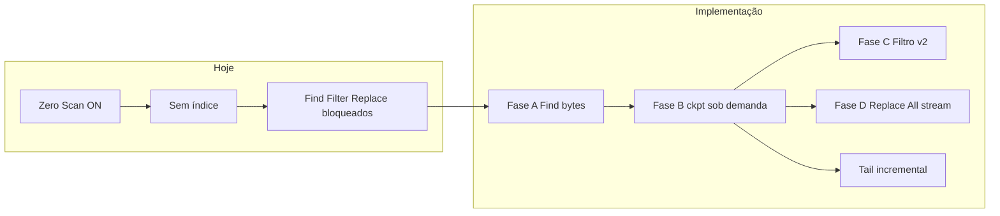

# FastFile — Impactos: Zero Scan completo e papel do processamento segmentado

**Documento de decisão e impacto** (resposta consolidada à análise de produto)  
Versão do produto de referência: `2.1.7.21`  
Ambiente: Delphi 7 / Win32  
Unidades principais: `MainUnit.pas`, `uSmoothLoading.pas`

> **Documentos relacionados**  
> - [DOC_ZS_ATALHOS.md](DOC_ZS_ATALHOS.md) — mapa F1 × Zero Scan ON (o que já atende)  
> - [DOC_ZERO_SCAN_CHECKLIST_TESTES.md](DOC_ZERO_SCAN_CHECKLIST_TESTES.md) — passo a passo QA (checklist marcável)  
> - [DOC_ZERO_SCAN_OPERACOES_PORTABILIDADE.md](DOC_ZERO_SCAN_OPERACOES_PORTABILIDADE.md) — especificação técnica completa, fases A–D, anatomia do código  
> - [DOC_SEGMENTED_HEAVY_OPS.md](DOC_SEGMENTED_HEAVY_OPS.md) — `EffectiveUseSegmentedHeavyOps`, Replace All e delete em lote  
> - [README.md](README.md) — menus Force Zero Scan, F5, INI  
> - [fastfile_arquitetura_bigdata.md](fastfile_arquitetura_bigdata.md) — SWAR, airbag 2B, scroll proporcional  

---

## Índice

1. [Objetivo deste documento](#1-objetivo-deste-documento)
2. [Respostas executivas](#2-respostas-executivas)
3. [Estado actual com Zero Scan activo](#3-estado-actual-com-zero-scan-activo)
4. [Pergunta 1 — O que implementar para paridade funcional](#4-pergunta-1--o-que-implementar-para-paridade-funcional)
5. [Impacto por funcionalidade (matriz)](#5-impacto-por-funcionalidade-matriz)
6. [Roadmap de implementação e esforço](#6-roadmap-de-implementação-e-esforço)
7. [Pergunta 2 — `EffectiveUseSegmentedHeavyOps` com Zero Scan](#7-pergunta-2--effectiveusesegmentedheavyops-com-zero-scan)
8. [Cenários combinados (Zero Scan + segmentado)](#8-cenários-combinados-zero-scan--segmentado)
9. [Riscos, limites e o que não é possível](#9-riscos-limites-e-o-que-não-é-possível)
10. [Ordem de trabalho recomendada](#10-ordem-de-trabalho-recomendada)
11. [Referência rápida de símbolos](#11-referência-rápida-de-símbolos)

---

## 1. Objetivo deste documento

Registar de forma **objectiva e acionável** os **impactos** de levar o FastFile a “funcionar completamente” com a flag **Zero Scan** activa na abertura (menu *Force Zero Scan*, política “sempre instantâneo”, ou ficheiro ≥ 15 GB), cobrindo:

- **Ctrl+F**, **Ctrl+H**, **Ctrl+L**
- **Tail** / follow
- **Editar**, inserir, apagar **uma** linha
- **Apagar em lote** (modo Select)
- Navegação, ir para linha, painel linha/coluna

E responder se a flag interna **`EffectiveUseSegmentedHeavyOps`** pode **suprir** as necessidades de **delete em lote** e **Replace All** nesse mesmo cenário.

Este texto **não substitui** o roadmap minucioso em [DOC_ZERO_SCAN_OPERACOES_PORTABILIDADE.md](DOC_ZERO_SCAN_OPERACOES_PORTABILIDADE.md); consolida a **decisão de produto** e o **mapa de impactos** para implementação e revisão.

---

## 2. Respostas executivas

### Pergunta 1 — Implementar o quê para Zero Scan “completo”?

| Resposta curta |
|----------------|
| **Não existe um único patch.** É um roadmap em **quatro fases (A→D)**: Find por bytes sem índice → indexação sob demanda (ckpt) → filtro v2 → Replace All por streaming. Cada feature desbloqueia-se em camadas diferentes. |

| Prioridade | Fase | Impacto principal |
|------------|------|-------------------|
| 1 | **A** | Ctrl+F / Find Next úteis **logo** após abertura instantânea (navegação por byte + linha estimada) |
| 2 | **B** | Ctrl+H (uma linha), edição/delete por linha, scroll exacto, ir para linha — após **ckpt** ou índice |
| 3 | **C** | Ctrl+L (filtro) sem `temp.txt` denso |
| 4 | **D** | Ctrl+H Replace **All** em titãs sem pico de RAM |
| Paralelo | **Tail** | Append de novas linhas exige evolução do índice no fim do ficheiro (hoje aborta sem `temp.txt`) |

### Pergunta 2 — `EffectiveUseSegmentedHeavyOps` supre delete / Replace All no Zero Scan?

| Resposta curta |
|----------------|
| **Em conjunto, sim — mas com papéis diferentes.** Zero Scan = **como abrir/navegar**; segmentado = **como reescrever** (menor pico de RAM). O segmentado **não substitui** a falta de índice na abertura: **precisa de `temp.txt` denso** hoje. Sem índice, Replace All / delete em lote segmentado **não arrancam**; usa-se fallback MMF ou, no futuro, Fase D (streaming). |

---

## 3. Estado actual com Zero Scan activo

### 3.1 Cadeia de bloqueio

```text
Abertura Zero Scan (Force / ≥15 GB / instantâneo)
  → Não corre TReadFileThread na abertura
  → Sem temp.txt / temp_ckpt.txt em disco (nesse momento)
  → HasLineSearchIndex = False
  → DoFindDialog / StartFindFromPos / StartFilter / Replace: Exit antes do motor
  → TryStartAutoIndexForSearch: se ShouldOpenWithInstantZeroScan → NÃO chama BeginRead
  → Mensagem: "Search needs a line index; disable Force Zero Scan and press F5."
```

### 3.2 O que já funciona (parcialmente)

| Capacidade | Comportamento actual |
|------------|----------------------|
| Abrir ficheiro enorme | Instantâneo; `totalLines` virtual (airbag 2B) ou estimativa |
| Scroll / ListView owner-data | Scroll **proporcional** (`UsesProportionalZeroScanScroll`) |
| Leitura de texto na viewport | `GetLineContent` por bytes estimados ou scan local |
| Motor BMH no ficheiro | **Implementado** em `TFindInFileThread`, mas **não chega a correr** na UI por falta de índice |
| Zero Scan + índice antigo no disco | Se `OpenFileStreams` abrir `temp.txt`/`temp_ckpt`, comportamento aproxima-se do modo indexado |

### 3.3 Confusão a evitar

| Conceito | Significado |
|----------|-------------|
| **`FForceZeroScan`** (menu View) | Não indexar **na abertura** do próximo ficheiro |
| **`FZeroScanMode`** (runtime) | Pode estar activo também sem o menu (estimativa, >500k linhas sem índice, airbag) |
| **“Zero Scan ON” + Find a funcionar** | Só se existir índice (F5 manual, ficheiro já indexado, ou **Fase B** futura) |

---

## 4. Pergunta 1 — O que implementar para paridade funcional

### 4.1 Princípio: paridade **funcional**, não de implementação

Copiar o `TFilterThread` actual (bitmap `FFilterBits` por linha) com Zero Scan ON é **inviável** em bilhões de linhas. O objectivo é o utilizador **conseguir a mesma tarefa** (procurar, filtrar, substituir, apagar) com motores adaptados (bytes, ckpt, hits em ficheiro, streaming).

### 4.2 Modelo alvo: `TLineMapKind`

| Camada | Ficheiro / flag | Operações desbloqueadas |
|--------|-----------------|-------------------------|
| `lmNone` | Zero Scan puro | Scroll aproximado; Find por byte (Fase A) |
| `lmProportional` | `FZeroScanBytesPerItem` | Idem + estimativa de linha |
| `lmSparseCkpt` | `temp_ckpt.txt` | Find exacto, Replace linha, GetLineContent, delete por linha |
| `lmDense` | `temp.txt` | + Filtro clássico; segmentado Replace/Delete |

Detalhe em [DOC_ZERO_SCAN_OPERACOES_PORTABILIDADE.md §9](DOC_ZERO_SCAN_OPERACOES_PORTABILIDADE.md#9-camadas-de-capacidade-recomendadas-modelo-alvo).

### 4.3 Fases de implementação (impacto)

#### Fase A — Find sem índice (impacto: **alto**, esforço: **pequeno/médio**)

**Objectivo:** Ctrl+F útil imediatamente após abertura Zero Scan.

| Alteração | Impacto |
|-----------|---------|
| Remover `Exit` em `StartFindFromPos` quando `not HasLineSearchIndex` | Find passa a arrancar |
| `TFindInFileThread`: `Idx` opcional; `FFoundLine` estimado ou -1 | BMH já existente reutilizado |
| `ScrollToFileBytePos` | ListView acompanha posição byte |
| Status bar: byte + “~linha estimada” | UX honesta sobre imprecisão |

**Não desbloqueia:** Ctrl+L, Replace linha exacta, delete em lote por número de linha fiável.

---

#### Fase B — Indexação sob demanda (impacto: **muito alto**, esforço: **médio**)

**Objectivo:** Utilizador com 50 GB pressiona Ctrl+F → “Indexar para busca precisa?” → gera pelo menos `temp_ckpt.txt`.

| Alteração | Impacto |
|-----------|---------|
| `TryStartAutoIndexForSearch` com confirmação mesmo com `FForceZeroScan` | Desbloqueia F5 implícito ao pedir busca |
| `TReadFileThread`: `FBuildDenseIndex := False` em titãs | Só ckpt em disco (~MB, não GB) |
| `HasLineSearchIndex = True` após ckpt | Find, Replace **uma**, edição, gotoLine coerentes |
| `UsesProportionalZeroScanScroll = False` com índice | Scroll deixa de ser “saltos” proporcionais |

**Não desbloqueia:** Filtro clássico (ainda exige denso) → Fase C.

---

#### Fase C — Filtro v2 (impacto: **médio**, esforço: **alto**)

**Objectivo:** Ctrl+L sem `temp.txt` e sem bitmap gigante.

| Alteração | Impacto |
|-----------|---------|
| `TFilterStreamThread` + `temp_filter_hits.bin` | Grep com milhões de hits sem RAM proporcional a todas as linhas |
| ListView `ItemCount := FFilteredCount` | Modo filtro visual em titãs |

---

#### Fase D — Replace All streaming (impacto: **médio** em titãs, esforço: **alto**)

**Objectivo:** Substituir todas as ocorrências sem carregar o ficheiro inteiro.

| Alteração | Impacto |
|-----------|---------|
| Pipeline fonte → `ff_replace_*.tmp` → rename | Replace All sem índice denso obrigatório |
| `BeginPostEditReindex` | Reconstruir ckpt/temp após mutação |

**Complementa** (não substitui) o caminho segmentado quando há `temp.txt` e `EffectiveUseSegmentedHeavyOps = True`.

---

#### Tail / follow (impacto: **médio**, esforço: **médio**)

**Estado actual:** `tmrTailTimer` detecta crescimento por **bytes**; `TailAppendNewLines` **aborta** se não existir `temp.txt` no diretório do exe.

| Alteração | Impacto |
|-----------|---------|
| Append incremental no fim: actualizar ckpt ou denso parcial | Tail útil com abertura Zero Scan |
| `gotoLine` ao fim após novas linhas | Coerência com sessão tail |

---

## 5. Impacto por funcionalidade (matriz)

Legenda: **Hoje** = v2.1.7.21 com Zero Scan na abertura e sem índice; **Alvo** = após fases indicadas.

| Funcionalidade | Atalho / entrada | Hoje (Zero Scan puro) | Alvo | Fase(s) |
|----------------|----------------|----------------------|------|---------|
| Abrir ficheiro | F5 / arrastar | OK instantâneo | OK | — |
| Scroll / ver linhas | Barra, roda | OK aproximado | OK exacto com ckpt | B |
| **Pesquisar** | **Ctrl+F** | **Bloqueado** | OK (byte); exacto com ckpt | A, B |
| Find Next / Previous | F3 / Shift+F3 | Bloqueado | OK | A, B |
| **Localizar e substituir (diálogo)** | **Ctrl+H** | Bloqueado (find) | OK | A, B |
| Substituir **uma** ocorrência | Replace | Bloqueado | OK com ckpt | B |
| Substituir **todas** | Replace All | Bloqueado + RAM | OK streaming / segmentado | B+D, segmentado |
| **Filtrar** | **Ctrl+L** | Bloqueado | OK filtro v2 | C (B recomendada) |
| Editar linha | duplo-clique / edição | Arriscado (linha ~) | OK com ckpt | B |
| Inserir / duplicar linha | atalhos edição | Arriscado | OK com ckpt | B |
| Apagar **uma** linha | Delete | Arriscado | OK com ckpt | B |
| Apagar **lote** (Select) | Ctrl+Shift+S + delete | Bloqueado / impreciso | OK + segmentado opcional | B + segmentado |
| Ir para linha | diálogo | Impreciso | OK | B |
| Painel linha/coluna | status | Estimativa | Exacto | B |
| Bookmarks / histórico | sessão | Linha pode falhar | Offset byte + linha | B + secundário |
| **Tail / follow** | menu Tools | Crescimento OK; **append falha** sem temp.txt | OK | Tail+ B |
| Export / split / merge | vários | Depende de linha/offset | Parcial → ckpt | B |
| Reindex pós-edição | automático | N/A sem índice inicial | OK | B, D |

---

## 6. Roadmap de implementação e esforço



| Fase | Entregável | Ficheiros / áreas tocadas (estimativa) | Esforço |
|------|------------|----------------------------------------|---------|
| **A** | Ctrl+F sem índice | `MainUnit.pas` (`StartFindFromPos`, `TFindInFileThread`, scroll byte) | P/M |
| **B** | Indexar ao pedir; só ckpt em titãs | `MainUnit.pas`, `uSmoothLoading*.pas`, `TryStartAutoIndexForSearch` | M |
| **C** | Filtro v2 | Nova thread + ListView filtrada | G |
| **D** | Replace All stream | `TReplaceAllThread`, confirmação disco | G |
| **Tail** | Append com ckpt | `TailAppendNewLines`, indexação incremental | M |

---

## 7. Pergunta 2 — `EffectiveUseSegmentedHeavyOps` com Zero Scan

### 7.1 O que a função faz (escopo exacto)

Consultada **apenas** para:

| Operação | Quando `True` (automático) |
|----------|----------------------------|
| **Replace All** | Ficheiro >100 MB **ou** >500k linhas **ou** política forçada |
| **Delete em lote** (Select) | Idem **ou** ≥200 linhas na operação |

Ver [DOC_SEGMENTED_HEAVY_OPS.md §3.3 e §4](DOC_SEGMENTED_HEAVY_OPS.md).

**Não consulta:** Ctrl+F, Ctrl+L, Tail, editar/apagar **uma** linha, abertura, scroll.

### 7.2 Dependência de índice (impacto crítico)

| Caminho | Precisa na prática |
|---------|-------------------|
| `TrySegmentedReplace` | Abre `FIndexFileName` (`temp.txt`); `TotalLines := Idx.Size div 20` |
| `TrySegmentedBatchDelete` | Faixas de **números de linha** no índice denso |
| Fallback MMF / streaming | Modelo de linhas; melhor com índice coerente |

**Conclusão:** `EffectiveUseSegmentedHeavyOps` decide **estratégia de reescrita**, não **cria** mapa de linhas. Com Zero Scan puro (`HasLineSearchIndex = False`), o segmentado **não supre** a necessidade — o programa deve usar fallback ou exigir indexação (Fase B) / streaming (Fase D).

### 7.3 Tabela de compatibilidade Zero Scan × segmentado

| Cenário | Zero Scan abertura | `HasLineSearchIndex` | `EffectiveUseSegmentedHeavyOps` | Resultado Replace All / delete lote |
|---------|-------------------|----------------------|--------------------------------|-------------------------------------|
| 1 | ON (Force) | False | True (auto) | Segmentado **falha/não aplica** → fallback MMF; operação pode falhar ou ser imprecisa |
| 2 | ON | False | False | Fallback único; mesmo problema de linhas |
| 3 | ON | True (só **ckpt**) | True | Find OK; segmentado **ainda exige denso** hoje → fallback |
| 4 | ON | True (**temp.txt**) | True | **Ideal:** segmentado + Zero Scan navegação já com índice |
| 5 | ON | False | — | **Fase D:** Replace All por bytes **sem** segmentado |
| 6 | OFF | True | True | Comportamento actual “grande ficheiro indexado” |

### 7.4 Pode usar “em conjunto”?

| Sim | Não |
|-----|-----|
| Zero Scan na **abertura** + utilizador **indexa** (Fase B) + Replace All com segmentado quando há **denso** e limiares automáticos | Segmentado **sozinho** substituir Fases A–B (não há cortes por linha sem índice) |
| Fase D (stream) para Replace All **sem** denso; segmentado como **opção** de menor RAM quando denso existe | `EffectiveUseSegmentedHeavyOps` activar Find ou Tail |
| Políticas independentes: View → Force Zero Scan vs Opções → segmentado | Um único “modo GB” para tudo |

**Frase de produto:** *Zero Scan evita trabalho na abertura; o segmentado evita pico de RAM na gravação — depois de existir mapa de linhas utilizável (denso para segmentar, ckpt para find/editar).*

### 7.5 Evolução opcional (impacto futuro)

| Melhoria | Benefício |
|----------|-----------|
| `TrySegmented*` aceitar **só `temp_ckpt.txt`** | Delete/Replace All segmentado em titãs sem índice denso de dezenas de GB |
| Replace All: se `EffectiveUseSegmentedHeavyOps` e sem denso → forçar Fase D em vez de fallback silencioso | Comportamento previsível em Zero Scan + titã |

---

## 8. Cenários combinados (Zero Scan + segmentado)

### 8.1 Utilizador típico — ficheiro 50 GB, Force Zero Scan ON

| Passo | Acção | Estado |
|-------|--------|--------|
| 1 | Abrir | Instantâneo; scroll proporcional |
| 2 | Ctrl+F (hoje) | Bloqueado |
| 2′ | Ctrl+F (após Fase A) | Find por byte; ~linha na barra |
| 3 | “Indexar para busca precisa” (Fase B) | Gera `temp_ckpt.txt`; minutos de I/O |
| 4 | Ctrl+F / Ctrl+H uma linha | Exacto (esparso) |
| 5 | Replace All + auto segmentado | Só se existir **`temp.txt`** denso ou Fase D; ckpt **não basta** para `TrySegmentedReplace` actual |
| 6 | Delete 500 linhas no Select + auto segmentado | Idem: denso ou fallback MMF |

### 8.2 Utilizador — 500 MB, Zero Scan por >500k linhas sem índice

| Item | Nota |
|------|------|
| Fase B pode gerar **denso** (~10 MB índice) | Segmentado passa a ser viável após indexação |
| `EffectiveUseSegmentedHeavyOps` | Provável `True` (>100 MB) após índice |

---

## 9. Riscos, limites e o que não é possível

| Limite | Impacto |
|--------|---------|
| `ListView.Items.Count` é `Integer` (máx. ~2,1×10⁹) | Airbag 2B linhas mantém-se |
| Filtro bit-a-bit para milhares de milhões de linhas | Impossível em 32-bit — só Filtro v2 |
| `temp.txt` para 2B linhas (~40 GB índice) | Impossível — política sparse-only |
| Linha **exacta** sem nunca ler `#10` | Impossível em Zero Scan puro |
| Match Replace All através de **fronteira de segmento** | Pode falhar (aviso já na confirmação segmentada) |
| Espaço em disco | Replace All / segmentado: ~tamanho ficheiro + temporários |

---

## 10. Ordem de trabalho recomendada

Para **máximo impacto com risco controlado**:

1. **Fase A** — desbloqueia Ctrl+F imediatamente (mensagem UX Zero Scan + bytes).
2. **Fase B** — desbloqueia o “núcleo” (edição, delete uma, Replace uma, scroll, auto-index ao pedir).
3. **Tail incremental** — em paralelo ou logo após B.
4. Ligar **delete lote / Replace All**: `if HasLineSearchIndex and denso and EffectiveUseSegmentedHeavyOps` → segmentado; senão Fase D ou MMF.
5. **Fase C** — filtro.
6. (Opcional) Segmentado com **ckpt** para titãs sem denso.

---

## 11. Referência rápida de símbolos

| Símbolo | Papel no tema deste documento |
|---------|-------------------------------|
| `FForceZeroScan` | Force Zero Scan na abertura |
| `FZeroScanMode` | Leitura proporcional / estimativa |
| `HasLineSearchIndex` | Porta de Find/Filter/Replace na UI |
| `ShouldOpenWithInstantZeroScan` | ≥15 GB ou Force → instantâneo |
| `TryStartAutoIndexForSearch` | Hoje não indexa se instantâneo forçado |
| `UsesProportionalZeroScanScroll` | Scroll aproximado sem índice |
| `TFindInFileThread` | BMH em bytes (motor já pronto) |
| `EffectiveUseSegmentedHeavyOps` | Só Replace All + delete lote |
| `TrySegmentedReplace` / `TrySegmentedBatchDelete` | Reescrita por segmentos (denso) |
| `tmrTailTimer` / `TailAppendNewLines` | Tail: precisa evolução de índice |

---

## Histórico

| Data | Nota |
|------|------|
| 2026-05-23 | Documento inicial — consolidação da análise Zero Scan + segmentado (perguntas 1 e 2). |
| 2026-05-23 | **Implementado em `MainUnit.pas` (v2.1.7.21+):** Fase A (find byte-only), Fase B (`BeginOnDemandLineIndex` + diálogo), Fase C (`TFilterStreamThread` + `FFilterHitsList`), Tail sem `temp.txt` (contagem de linhas no delta). Replace All streaming já existia em `TReplaceAllThread`; segmentado inalterado quando há `temp.txt`. Modo indexado (não Zero Scan): caminhos antigos preservados quando `HasLineSearchIndex` / `FIndexFileStream`. |
| 2026-05-23 | **Indexação sob demanda (Zero Scan only):** `uTemporaryFileStream.pas` + `TReadFileThread` com `AZeroScanOnDemandIndex` (default `False`). `BeginRead` / F5 / `BeginPostEditReindex` **não** passam o flag — comportamento indexado inalterado. Só `BeginOnDemandLineIndex` usa temp stream + rename para `temp.txt` / `temp_ckpt.txt`. |
| 2026-05-23 | **`TBufferedTextWriter`:** fila de 8192 offsets `Int64` em RAM; descarga em blocos de 20 bytes/registo (`INDEX_RECORD_BYTES`). Posições de ficheiro e `AbsOffset` na varredura usam `Int64` (sem estouro acima de ~2 GB). |
| 2026-05-23 | **Fases E1–E5 (só Zero Scan):** `uZeroScanBlockIndex.pas` (`temp_blk.idx` 64 MB), Find em MMF + hint de bloco, filtro `temp_filter_hits.bin`, bookmarks por byte, Tail append em `temp_ckpt`, `BeginPostEditReindex` com `AZeroScanOnDemandIndex`. Modo indexado denso: inalterado. |
| 2026-05-26 | **Paridade §8 DOC_ZS_ATALHOS:** `GotoPhysicalLine1Based` / `PhysicalByteOffset1BasedForPhysicalLine1Based` (Ctrl+G físico); `DoFindReplace` sem bloqueio inicial (Replace All + Find com YES/NO); delete lote com `TryStartAutoIndexForMutation`; ajuda F1 secção ZERO SCAN. Scroll proporcional na roda permanece ~ até indexar. |

---

## 12. Estado da implementação (código)

| Item | Estado |
|------|--------|
| Fase A — Ctrl+F sem índice | **Feito** — `StartFindFromPos` byte-only, `ScrollToFileBytePos` |
| Fase B — indexar sob demanda | **Feito** — `TryStartAutoIndexForSearch` (YES/NO/CANCEL), `BeginOnDemandLineIndex` + `TTemporaryFileStream` (`AZeroScanOnDemandIndex`) |
| Regressão modo indexado | **Preservado** — `TReadFileThread.Create` sem 7.º parâmetro = caminho `NewFastFileTemp` + escrita directa em `temp.txt` |
| Fase C — filtro sem denso | **Feito** — `TFilterStreamThread`, `StartFilterStream` |
| Fase D — Replace All stream | **Já existia** — `TReplaceAllThread.Execute` (MMF); desbloqueado após diálogo sem índice |
| Tail sem `temp.txt` | **Feito** — contagem `#10` no delta + `gotoLine` |
| Atalhos Read (Ctrl+G, Ctrl+Shift+G, F3, edição, colar, bookmarks, Home/End) | **Feito** — ver §13 |
| E1 Find MMF + `temp_blk.idx` | **Feito** — só `FUseZeroScanFastIO` / indexação sob demanda |
| E2 Filtro hits em disco | **Feito** — `temp_filter_hits.bin` em `UsesProportionalZeroScanScroll` |
| E3 Reindex pós-edit ZS | **Feito** — `BeginPostEditReindex` ramo sem `temp.txt` |
| E4 Bookmarks byte + Ctrl+G bloco | **Feito** — `FBookmarkBytes`, `gotoLine` com hint |
| E5 Tail ckpt incremental | **Feito** — append em `temp_ckpt.txt` no delta |
| `EffectiveUseSegmentedHeavyOps` | **Sem alteração** — continua a exigir `temp.txt` denso; compatível após indexação sob demanda |

---

## 13. Atalhos do painel Read com Zero Scan

> **Documento completo (todos os atalhos F1):** [DOC_ZS_ATALHOS.md](DOC_ZS_ATALHOS.md)

### Níveis ZS (performance / expectativa)

| Nível | Ficheiros | Ctrl+F / F3 | Ctrl+L | Ctrl+G |
|-------|-----------|-------------|--------|--------|
| **ZS-0** | — | Bytes + MMF; sem `temp_blk` | Stream → `temp_filter_hits.bin` | Estimativa |
| **ZS-1** | `temp_filter_hits.bin` | Idem | Export stream | Idem |
| **ZS-2** | `temp_ckpt` + `temp_blk.idx` | MMF + hint 64 MB | Idem + linha ckpt | `gotoLine` + bloco |
| **ZS-3** | `temp.txt` denso | Motor clássico (não Zero Scan) | `TFilterThread` | Exacto |

Com **abertura instantânea** (sem `temp.txt` / `temp_ckpt`), a maioria dos atalhos **já estava ligada** em `ApplyReadPanelKey` / `FormKeyDown`; o que faltava era **lógica** que não exigisse índice denso.

| Atalho | Zero Scan (sem índice) |
|--------|-------------------------|
| Ctrl+F / F3 / Shift+F3 | Busca por bytes; diálogo YES=index / NO=bytes |
| Ctrl+H | Find/Replace All; replace uma linha usa contagem física até ao byte encontrado |
| Ctrl+L | Filtro stream (`TFilterStreamThread`) |
| Ctrl+G | `gotoLine` na viewport (linha **estimada**; aviso na barra) |
| Ctrl+Shift+G | `ScrollToFileBytePos` (sem `temp.txt`) |
| Ctrl+Z / Ctrl+Y | Undo/redo (após edição; reindex pós-mutação) |
| Ctrl+C / Ctrl+V / Shift+Insert | Copiar/colar; colar pede indexação ou linha física (scan) |
| Ctrl+Shift+E/I/U/D | Edição: diálogo indexar / linha física aproximada |
| Ctrl+B / F2 / Shift+F2 | Bookmarks na linha da viewport |
| Shift+Home / Shift+End | Início/fim da lista (como antes) |
| Ctrl+T / Tail | Seguir ficheiro; append sem índice conta novas linhas |
| F5 | Abertura instantânea se Force Zero Scan; senão indexa |
| Duplo-clique | `editFile` (mesmas regras de edição) |
| Toolbar (split, merge, export, …) | Inalterado; operações em ficheiro não dependem do mapa de linhas na UI |

Funções novas em `MainUnit.pas`: `GetLineStartOffset` (ramo Zero Scan), `CountPhysicalLinesUpToByte1Based`, `PhysicalLine1BasedForListLine0`, `TryStartAutoIndexForMutation`.

---

*Especificação técnica das fases: [DOC_ZERO_SCAN_OPERACOES_PORTABILIDADE.md](DOC_ZERO_SCAN_OPERACOES_PORTABILIDADE.md).*
