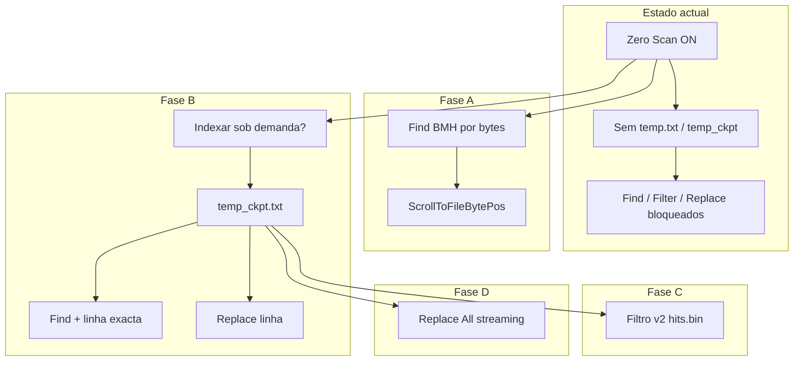

# FastFile — Zero Scan e portabilidade de operações (busca, filtro, substituir)

**Documento de arquitetura e roadmap**  
Versão do produto de referência: `2.1.7.21`  
Ambiente: Delphi 7 / Win32 (processo 32-bit)  
Unidade principal: `MainUnit.pas`

> **Documentos relacionados**  
> - [DOC_ZS_ATALHOS.md](DOC_ZS_ATALHOS.md) — mapa F1 × Zero Scan ON (atalhos e o que já atende)  
> - [DOC_ZERO_SCAN_CHECKLIST_TESTES.md](DOC_ZERO_SCAN_CHECKLIST_TESTES.md) — checklist QA marcável  
> - [DOC_ZERO_SCAN_IMPACTOS_E_SEGMENTADO.md](DOC_ZERO_SCAN_IMPACTOS_E_SEGMENTADO.md) — **resumo de impactos** e resposta consolidada (paridade funcional + `EffectiveUseSegmentedHeavyOps`)  
> - [README.md — Open mode and Zero Scan](README.md#open-mode-and-zero-scan) (guia do utilizador, menus, INI)  
> - [fastfile_arquitetura_bigdata.md](fastfile_arquitetura_bigdata.md) (SWAR, airbag 2B, scroll proporcional)  
> - [DOC_UNICODE_LISTVIEW_PROPOSTA.md](DOC_UNICODE_LISTVIEW_PROPOSTA.md) (Unicode na ListView — ortogonal a este tema)  
> - [DOC_SEGMENTED_HEAVY_OPS.md](DOC_SEGMENTED_HEAVY_OPS.md) (gravação segmentada — Replace All / delete; ortogonal a Zero Scan)

---

## Índice

1. [Objetivo deste documento](#1-objetivo-deste-documento)
2. [Glossário](#2-glossário)
3. [Dois modos de abertura (visão geral)](#3-dois-modos-de-abertura-visão-geral)
4. [Ficheiros e estruturas no disco](#4-ficheiros-e-estruturas-no-disco)
5. [Flags e funções internas (estado actual)](#5-flags-e-funções-internas-estado-actual)
6. [Por que Ctrl+F não funciona com Zero Scan ON](#6-por-que-ctrlf-não-funciona-com-zero-scan-on)
7. [Anatomia de cada operação no código actual](#7-anatomia-de-cada-operação-no-código-actual)
8. [O que “portabilidade” pode e não pode significar](#8-o-que-portabilidade-pode-e-não-pode-significar)
9. [Camadas de capacidade recomendadas (modelo alvo)](#9-camadas-de-capacidade-recomendadas-modelo-alvo)
10. [Proposta por funcionalidade (detalhe minucioso)](#10-proposta-por-funcionalidade-detalhe-minucioso)
11. [Limitações Win32 e ordens de grandeza](#11-limitações-win32-e-ordens-de-grandeza)
12. [Roadmap em fases](#12-roadmap-em-fases)
13. [Experiência do utilizador (UX) sugerida](#13-experiência-do-utilizador-ux-sugerida)
14. [Mapa de símbolos no código (referência rápida)](#14-mapa-de-símbolos-no-código-referência-rápida)
15. [Perguntas frequentes](#15-perguntas-frequentes)

---

## 1. Objetivo deste documento

Este texto regista, de forma **minuciosa**, o raciocínio técnico para levar ao modo **Zero Scan ON** (abertura instantânea de ficheiros enormes, por exemplo **50 GB**) as mesmas famílias de operações que hoje dependem de **índice de linhas** (offsets em bytes por linha):

| Atalho / acção | Operação |
|----------------|----------|
| **Ctrl+F** | Pesquisar / Find Next |
| **Ctrl+L** | Filtrar / Grep visual |
| **Ctrl+H** | Localizar e substituir |
| Edição por linha, ir para linha, bookmarks, etc. | Dependem de `GetLineContent` e número de linha real |

O documento serve para:

- alinhar expectativas (o que é possível sem indexar vs. com indexação parcial);
- orientar implementação futura sem duplicar lógica;
- explicar ao utilizador final **por que** o Find falha hoje com Zero Scan e **o que** mudar no produto.

**Não é** um guia de compilação; é especificação de arquitectura.

---

## 2. Glossário

| Termo | Significado |
|-------|-------------|
| **Zero Scan** | Abertura **sem** executar `TReadFileThread` na primeira leitura: não se constrói `temp.txt` nem `temp_ckpt.txt` naquele momento. |
| **Indexação (F5)** | Passagem pelo ficheiro (motor SWAR / MMF em `uSmoothLoading_utf8.pas`) que conta linhas e grava índices em disco. |
| **Índice denso** | Ficheiro `temp.txt`: um registo de **20 bytes** por **cada** linha (offset 1-based do início da linha no ficheiro fonte). |
| **Índice esparso (checkpoint)** | Ficheiro `temp_ckpt.txt`: um registo a cada **1024 linhas** (`CKPT_INTERVAL`). |
| **`HasLineSearchIndex`** | Função que devolve `True` se existir stream aberto para `temp.txt` **ou** `temp_ckpt.txt`. |
| **`FZeroScanMode`** | Flag interna: leitura proporcional por bytes quando **não** há índice fiável; scroll “aproximado”. |
| **`FForceZeroScan`** | Preferência do menu **View → Force Zero Scan** (e `ASkin.ini`); força abertura instantânea sempre. |
| **`UsesProportionalZeroScanScroll`** | `FZeroScanMode` **e** ausência de índice → barra vertical limitada por `FileSize / FZeroScanBytesPerItem`. |
| **Offset (byte)** | Posição 0-based no ficheiro fonte; a busca BMH trabalha neste espaço. |
| **Line index** | Número da linha 0-based na ListView owner-data (`Offset + linha visível`). |
| **Airbag 2B** | Paragem da indexação ao atingir **2 000 000 000** linhas para não rebentar `Integer` na ListView. |

---

## 3. Dois modos de abertura (visão geral)

### 3.1 Modo indexado (Zero Scan **efectivamente OFF** na abertura)

1. Utilizador carrega ficheiro e pressiona **F5** (ou fluxo equivalente em `BeginRead`).
2. `TReadFileThread` percorre o ficheiro (SWAR).
3. São criados, conforme política de tamanho:
   - `temp.txt` (denso), e/ou
   - `temp_ckpt.txt` (esparso).
4. `finishFileNameRead` define `totalLines` **real**, `ItemCount`, abre streams em `OpenFileStreams`.
5. **Ctrl+F**, filtro (se denso), substituir e scroll usam linhas **reais**.

### 3.2 Modo Zero Scan instantâneo (Zero Scan **ON** na abertura)

1. `ShouldOpenWithInstantZeroScan` devolve `True` (Force Zero Scan, menu “sempre instantâneo”, ou ficheiro **≥ 15 GB** em política automática).
2. Chama-se `finishFileNameRead('Instant Open (Zero Scan)', 2000000000, fileSize)` **sem** thread de leitura.
3. **Não** existem `temp.txt` / `temp_ckpt.txt` para esse ficheiro (até um F5 manual posterior).
4. `ApplyZeroScanVirtualLineCount` estima linhas (amostra 4 MB início + refinamento 4 MB fim).
5. Scroll e **Shift+End** são **proporcionais**, não linha-a-linha exactos.
6. `HasLineSearchIndex` é **False** → Find/Filtro/Substituir bloqueiam ou pedem indexação.

### 3.3 Tabela de decisão na abertura (automático)

| Prioridade | Condição | Resultado |
|------------|----------|-----------|
| 1 | `FForceZeroScan` | Instantâneo |
| 2 | Menu “Abrir: sempre instantâneo” | Instantâneo |
| 3 | Menu “Abrir: sempre indexar” | Indexação (`TReadFileThread`) |
| 4 | Automático e tamanho **≥ 15 GB** | Instantâneo |
| 5 | Automático e tamanho **< 15 GB** | Indexação |

Constante: `ZeroScanAutoOpenMinFileSize` = `15 × 1024³` bytes.

### 3.4 Confusão frequente: `FZeroScanMode` vs. menu “Force Zero Scan”

- **Menu Force Zero Scan** = `FForceZeroScan`: controla **como abrir** no próximo F5.
- **`FZeroScanMode`** pode estar activo também quando:
  - abertura instantânea (contagem virtual 2B);
  - ficheiro indexado mas **sem** índice em disco e linhas > 500 000 (modo proporcional interno);
  - airbag 2B durante indexação.

**Importante (correcção recente):** se o ficheiro **foi indexado** e `HasLineSearchIndex` é verdadeiro, scroll e Find **não** devem usar scroll proporcional (`UsesProportionalZeroScanScroll = False`), mesmo que o ficheiro tenha 10 GB.

---

## 4. Ficheiros e estruturas no disco

### 4.1 Ficheiro fonte

- Caminho em `edtFileName` / `CurrentEffectiveFilePath`.
- Stream: `FSourceFileStream` (`TFileStream`, leitura partilhada).

### 4.2 `temp.txt` — índice denso

| Propriedade | Valor |
|-------------|--------|
| Constante | `INDEX_RECORD_SIZE = 20` |
| Formato de cada registo | 18 caracteres ASCII + padding → offset **1-based** início da linha |
| Tamanho em disco | `totalLines × 20` bytes |
| Exemplo | 10 milhões de linhas → ~190 MB só de índice |
| Uso actual | `GetLineContent` (caminho denso), `TFilterThread`, `TFindInFileThread.OffsetToLineIndex` |

**Leitura de uma linha (denso):**

1. Posição no índice: `IdxPos := LineIndex × 20`.
2. Lê offset início; lê offset da linha seguinte (ou EOF).
3. `Seek` no fonte e lê `EndOffset - StartOffset` bytes (limitado por `MAX_LINE_LEN_DISPLAY`).

### 4.3 `temp_ckpt.txt` — índice esparso

| Propriedade | Valor |
|-------------|--------|
| Intervalo | `CKPT_INTERVAL = 1024` linhas |
| Registos | Um offset a cada 1024 linhas |
| Tamanho em disco | `≈ (totalLines / 1024) × 20` bytes |
| Exemplo | 100 milhões de linhas → ~1,9 MB de ckpt |
| Uso actual | `GetLineContent` (scan forward até `#10`), `TFindInFileThread` com `FUseSparseLineMap` |

**Leitura de uma linha (esparso):**

1. `CkptIdx := LineIndex div 1024`.
2. Lê offset do checkpoint; avança `LineIndex mod 1024` quebras de linha no fonte.
3. Procura o `#10` seguinte para o fim da linha.

### 4.4 Nenhum índice (Zero Scan puro)

- `GetLineContent` usa caminho **proporcional**: `LineIndex × FZeroScanBytesPerItem` → scan local para `#10`.
- Precisão de “número da linha” **não** é garantida; é adequado para **visualização rápida**, não para grep fiável.

---

## 5. Flags e funções internas (estado actual)

```text
HasLineSearchIndex :=
  Assigned(FIndexFileStream) OR Assigned(FCkptFileStream)

UsesProportionalZeroScanScroll :=
  FZeroScanMode AND (NOT HasLineSearchIndex)

ListViewScrollExtent :=
  Se UsesProportionalZeroScanScroll:
    min(ItemCount, ceil(FileSize / FZeroScanBytesPerItem))
  Senão:
    ItemCount (linhas reais ou filtradas)
```

| Função / procedimento | Ficheiro | Papel |
|----------------------|----------|--------|
| `ShouldOpenWithInstantZeroScan` | MainUnit.pas | Porta de abertura instantânea |
| `BeginRead` / `finishFileNameRead` | MainUnit.pas | Indexar vs. instantâneo |
| `OpenFileStreams` | MainUnit.pas | Abre fonte + índices se existirem |
| `GetLineContent` | MainUnit.pas | Texto da linha (denso / esparso / proporcional) |
| `TryStartAutoIndexForSearch` | MainUnit.pas | Tenta F5 automático antes de busca |
| `DoFindDialog` / `StartFindFromPos` | MainUnit.pas | UI e arranque da thread de busca |
| `TFindInFileThread.Execute` | MainUnit.pas | BMH no ficheiro + mapa para linha |
| `StartFilter` / `TFilterThread.Execute` | MainUnit.pas | Filtro linha a linha via denso |
| `DoFindReplace` | MainUnit.pas | Substituição na linha actual |

---

## 6. Por que Ctrl+F não funciona com Zero Scan ON

### 6.1 O bloqueio não é “o algoritmo de busca”

A thread `TFindInFileThread` **já implementa busca por conteúdo em bytes** no ficheiro fonte (Boyer-Moore-Horspool, buffer 1 MB). O índice **não** é usado para encontrar o texto.

Fluxo real em `TFindInFileThread.Execute`:

```text
1. Abrir SourceStream (ficheiro fonte)
2. Abrir Idx (temp.txt OU temp_ckpt.txt) — obrigatório hoje no arranque
3. Percorrer bytes com BMH até achar Needle
4. CandidateAbs := posição encontrada
5. FFoundLine := OffsetToLineIndex OU SparseOffsetToLineIndex
6. UI: gotoLine / destacar / barra de estado
```

O passo **5** exige mapa linha↔byte. Sem índice:

- não há busca binária em `temp.txt`;
- não há checkpoints em `temp_ckpt.txt`;
- não há linha fiável para `gotoLine`.

### 6.2 O bloqueio na UI

Em `DoFindDialog` (e equivalentes):

```pascal
if not HasLineSearchIndex then
begin
  if TryStartAutoIndexForSearch then Exit;
  if not HasLineSearchIndex then Exit;
end;
```

`TryStartAutoIndexForSearch`:

- Se o ficheiro entra em `ShouldOpenWithInstantZeroScan` (≥ 15 GB, Force Zero Scan, etc.), **não** inicia `BeginRead`; mostra mensagem no status bar.
- Caso contrário, chama `BeginRead` e pode definir `FDeferredFindAfterIndex` para repetir a busca ao fim.

### 6.3 Resumo em uma frase

**Zero Scan ON na abertura = sem mapa de linhas em disco → Find é recusado antes de correr o BMH**, porque o produto exige **número de linha** para navegar na ListView, não só offset em bytes.

---

## 7. Anatomia de cada operação no código actual

### 7.1 Pesquisar (Ctrl+F) — `TFindInFileThread`

| Aspecto | Detalhe |
|---------|---------|
| Entrada | `FFindText`, `FStartPos` (byte), direcção |
| Algoritmo | BMH, case sensitive ou tabela `Up[]` |
| Progresso | `SyncFindBytesProgress` a cada ~2 MB |
| Índice denso | `OffsetToLineIndex`: busca binária em offsets |
| Índice esparso | `SparseOffsetToLineIndex` + `LineStartByteSparse` |
| Sem índice | **Não suportado** (Exit em `StartFindFromPos`) |

**Conclusão:** a pesquisa de texto é portável; a **navegação para a linha** é o que falta no Zero Scan.

### 7.2 Filtrar (Ctrl+L) — `TFilterThread`

| Aspecto | Detalhe |
|---------|---------|
| Pré-requisito | `FIndexFileStream` **obrigatório** (`StartFilter`) |
| Loop | Para `I := 0` .. `FTotalLines-1`, lê offsets denso, lê linha inteira do fonte |
| Resultado | `FFilterBits`: **1 bit por linha** + `FFilterJumpTable` |
| Modos | Contains, prefix, regex (VBScript.RegExp em thread COM) |
| Sparse only | Mensagem explícita: filtro exige `temp.txt` |

**Limites de memória (32-bit):**

- `FFilterBitsSize` bytes ≈ `totalLines / 8`.
- 100 milhões de linhas → ~12,5 MB de bitmap (ainda viável).
- 500 milhões → ~62 MB (limite prático depende de RAM livre).
- 2 mil milhões → **impossível** em processo 32-bit.

O próprio `TFilterThread` aborta se não conseguir alocar o bitmap (`Filter: line count too large for filter memory`).

**Conclusão:** filtro **não** é portável copiando o código actual; exige **Filtro v2** (resultados em ficheiro ou lista externa).

### 7.3 Substituir (Ctrl+H) — `DoFindReplace`

| Passo | Dependência |
|-------|-------------|
| Find Next | `StartFindFromPos` → índice |
| Replace linha actual | `FLastFoundLine`, `GetLineContent(FLastFoundLine)`, `ApplyEditWithUndo` |
| Replace All | Percorre linhas / ficheiro com índice e pipeline de escrita atómica |

Substituir **uma** ocorrência é “Find + edição de linha”. Sem linha exacta, o replace na linha errada corrompe dados em ficheiros grandes.

**Replace All** em 50 GB implica reescrita massiva (ver secção 10.4).

### 7.4 Outras funcionalidades ligadas ao índice

| Funcionalidade | Dependência típica |
|----------------|-------------------|
| Ir para linha (`gotoLine`) | `ItemCount` real ou índice filtrado |
| Painel linha/coluna | `FileLineIndexFromListRow` + `totalLines` |
| Export selecção / split / merge | Leitura por linha ou offset |
| Scripts / ConsumerAI | Mensagem de “sparse index” em ficheiros grandes |
| Reindex pós-edição | `BeginPostEditReindex`, `temp_ckpt` reconstruído |

---

## 8. O que “portabilidade” pode e não pode significar

### 8.1 Pode (objectivos realistas)

1. **Find** em ficheiro aberto em Zero Scan, com ou sem indexação prévia.
2. **Indexação sob demanda** (uma passagem SWAR) gerando pelo menos `temp_ckpt.txt`.
3. **Find + Replace por linha** após índice esparso.
4. **Filtro** como grep com resultados em ficheiro auxiliar (sem bitmap gigante).
5. **Navegação por offset** (byte) quando não houver linha exacta, com indicação “estimado” na UI.

### 8.2 Não pode (limites físicos / 32-bit)

1. Filtro com **bit por linha** para **bilhões** de linhas.
2. `temp.txt` denso para **2B linhas** (~40 GB só de índice).
3. `ListView.Items.Count` > **2 147 483 647** (airbag existe precisamente por isto).
4. Abrir 50 GB **e** ter todas as linhas materializadas em RAM.
5. Garantir número de linha **exacto** no Zero Scan puro sem nunca ler o ficheiro (contar `#10` exige I/O).

### 8.3 “Paridade funcional” vs. “paridade de implementação”

| Abordagem | Descrição |
|-----------|-----------|
| **Paridade de implementação** | Mesmo `TFilterThread` + `FFilterBits` com Zero Scan ON → **inviável**. |
| **Paridade funcional** | Utilizador obtém “filtrar linhas que contêm X”, mas motor novo, progresso, talvez limite de hits → **viável**. |

---

## 9. Camadas de capacidade recomendadas (modelo alvo)

### 9.1 Abstracção conceptual: mapa de linhas

Introduzir (conceptualmente) um contrato único, por exemplo `ILineMap` / `TLineMapKind`:

```text
enum TLineMapKind {
  lmNone,           // Zero Scan puro
  lmProportional,   // estimativa FZeroScanBytesPerItem
  lmSparseCkpt,   // temp_ckpt.txt
  lmDense         // temp.txt
}
```

Operações consultam o mapa:

| Método conceptual | lmNone | lmProportional | lmSparse | lmDense |
|-------------------|--------|----------------|----------|---------|
| LineCount | estimado | estimado | exacto | exacto |
| ByteOffsetOfLine(i) | approx | approx | scan+ckpt | O(1) |
| LineIndexOfByte(pos) | approx | approx | O(log n) sparse | O(log n) dense |
| ReadLine(i) | scan local | scan local | scan | O(1) seek |

### 9.2 Matriz capacidade × modo

| Operação | lmNone | lmSparse | lmDense |
|----------|--------|----------|---------|
| Scroll / ver texto | Sim (aprox.) | Sim | Sim |
| Ctrl+F | Sim* | Sim | Sim |
| Ctrl+L | Não** | Sim*** | Sim |
| Ctrl+H (uma) | Não | Sim | Sim |
| Ctrl+H (todas) | Não | Sim**** | Sim**** |

\* Com navegação por **byte** ou linha estimada; precisão opcional após ckpt.  
\** Apenas grep externo ou indexar antes.  
\*** Com **Filtro v2** (hits em ficheiro).  
\**** Pipeline streaming; sempre com confirmação e ficheiro de saída.

---

## 10. Proposta por funcionalidade (detalhe minucioso)

### 10.1 Fase A — Find sem índice (busca por bytes)

**Objectivo:** Ctrl+F útil **imediatamente** após abertura Zero Scan, sem esperar indexação.

**Alterações conceptuais:**

1. `StartFindFromPos`: remover `Exit` quando `not HasLineSearchIndex`; passar flag `FLineMapKind` à thread.
2. `TFindInFileThread`: tornar `Idx` opcional; se nil, `FFoundLine := -1` ou linha estimada `CandidateAbs div AvgBytesPerLine`.
3. Novo `ScrollToFileBytePos(Pos: Int64)`:
   - calcula `Offset` da ListView a partir de posição byte / tamanho ficheiro;
   - invalida cache de linhas;
   - status bar: `Byte 1 234 567 890 / 50 000 000 000` e opcional `~linha 4 500 000`.
4. Manter BMH **inalterado** (já correcto para ficheiros grandes).

**Prós:** baixo risco, reutiliza 90% do código.  
**Contras:** “Ir para linha” pode estar desfasado até existir ckpt.  
**Esforço estimado:** pequeno/médio.

---

### 10.2 Fase B — Indexação sob demanda (só esparso ou completo)

**Objectivo:** Utilizador com 50 GB pressiona Ctrl+F → diálogo: *“Indexar para busca precisa? Tempo estimado: …”*.

**Fluxo:**

```text
TryStartAutoIndexForSearch (melhorado)
  Se ForceZeroScan E utilizador não confirmou → pedir confirmação
  BeginRead com modo:
    - IndexSparseOnly se tamanho > limiar (ex. 500k linhas ou > 15 GB)
    - IndexDense se ficheiro “pequeno”
  Ao terminar: OpenFileStreams, RunDeferredFindAfterIndexIfNeeded
```

**Alterações em `TReadFileThread` / `uSmoothLoading`:**

- Flag `FBuildDenseIndex: Boolean` (False para titãs).
- Sempre gravar `temp_ckpt.txt` quando possível.
- `temp.txt` só se `totalLines × 20` < limiar de disco/RAM política.

**Resultado:**

- `HasLineSearchIndex = True` (ckpt aberto).
- Find usa `FUseSparseLineMap = True` (já implementado).
- `GetLineContent` usa caminho esparso (já implementado).
- Filtro clássico **ainda não** (exige denso) → mensagem ou Fase C.

**Prós:** máxima reutilização; comportamento igual ao “Zero Scan OFF” para Find/Replace linha.  
**Contras:** uma leitura completa do disco (minutos em 50 GB frio).  
**Esforço estimado:** médio.

---

### 10.3 Fase C — Filtro v2 (grep sem `FFilterBits` gigante)

**Objectivo:** Ctrl+L em ficheiro só com ckpt ou mesmo sem índice.

**Algoritmo proposto:**

```text
Thread TFilterStreamThread:
  Pos := 0
  LineNum := 0
  Abrir temp_filter_hits.bin para escrita
  Enquanto Pos < FileSize:
    Ler bloco (1–4 MB)
    Para cada #10 no bloco:
      Extrair linha [Start, End) com limite MAX_LINE_LEN_DISPLAY para teste
      Se Match(Needle, modo): Append(LineNum) ao hits.bin
      Inc(LineNum)
    Reportar progresso (linhas ou bytes)
  FFilteredCount := número de registos em hits.bin
  Construir FFilterJumpTable a partir de hits (como hoje, saltos 1024)
```

**ListView em modo filtro:**

- `ItemCount := FFilteredCount` (não `totalLines`).
- `GetLineContent` para linha filtrada `k`: `realLine := hits[k]` → ler via mapa esparso/denso.

**Variantes:**

| Variante | Quando usar |
|----------|-------------|
| **Hits só offsets** | Menos RAM; seek por offset |
| **Hits só line numbers** | Compatível com ckpt |
| **Limite max hits** | UI responsiva (ex. primeiros 1 000 000 matches) |

**Prós:** escala a centenas de milhões de linhas.  
**Contras:** novo código; regex continua dependente de COM; ficheiro auxiliar a gerir.  
**Esforço estimado:** alto.

---

### 10.4 Fase D — Substituir e Replace All

#### 10.4.1 Substituir ocorrência actual

Depende de Fase A ou B:

- Com ckpt: `FLastFoundLine` exacto → fluxo actual `ApplyEditWithUndo`.
- Só bytes: substituir no intervalo `[LineStart, LineEnd)` obtido por scan local a partir de `FFoundFilePos` (sem número de linha global).

#### 10.4.2 Substituir todas

**Nunca** carregar 50 GB na memória.

Pipeline recomendado:

```text
1. Confirmar + mostrar espaço em disco (cópia quase do tamanho do ficheiro)
2. TMMFReader / stream read do fonte
3. Stream write para ff_replace_<tick>.tmp
4. BMH ou scan linha-a-linha com buffer
5. Rename atómico (padrão já documentado no README)
6. BeginPostEditReindex (reconstruir ckpt/temp)
```

**Riscos:** tempo longo; ficheiro aberto noutro processo; quota de disco.

---

### 10.5 Funcionalidades adicionais (prioridade secundária)

| Funcionalidade | Estratégia com Zero Scan |
|----------------|--------------------------|
| Bookmarks | Guardar **byte offset** + path, não só número de linha |
| Histórico sessão | Idem |
| Tail / follow | Já orientado a bytes no fim do ficheiro |
| Compare / diff | Fora de âmbito; continua a precisar modelo próprio |
| Multi-ocorrência na mesma linha | Find já avança `FLastFoundFilePos + 1` |

---

## 11. Limitações Win32 e ordens de grandeza

### 11.1 Tamanho de índice denso

```text
Tamanho_temp.txt ≈ totalLines × 20 bytes
```

| Linhas | Índice denso |
|--------|----------------|
| 1 000 000 | ~19 MB |
| 10 000 000 | ~190 MB |
| 100 000 000 | ~1,9 GB |
| 2 000 000 000 | ~37 GB (irreal em 32-bit) |

### 11.2 Tamanho de índice esparso

```text
Tamanho_temp_ckpt ≈ (totalLines / 1024) × 20 bytes
```

| Linhas | Ckpt |
|--------|------|
| 100 000 000 | ~1,9 MB |
| 2 000 000 000 | ~37 MB |

→ Para titãs, **política default deve ser sparse-only**.

### 11.3 Tempo de indexação (ordem de magnitude)

Com SWAR ~1,4 GB/s (cache quente):

| Tamanho ficheiro | Tempo ordem |
|------------------|-------------|
| 10 GB | ~7–25 s |
| 50 GB | ~35 s – 6 min |
| 500 GB | minutos a horas |

Cold read (HDD) pode ser **3× pior** ou mais.

### 11.4 ListView e `Integer`

- `ListView1.Items.Count` é `Integer` → máximo **2 147 483 647**.
- `ItemCount` / `totalLines` usam `Int64` na lógica, mas a VCL impõe tecto.
- Airbag em **2 000 000 000** linhas deixa margem.

---

## 12. Roadmap em fases



| Fase | Entrega | Dependências |
|------|---------|--------------|
| **A** | Ctrl+F em Zero Scan (byte + linha ~estimada) | Nenhuma |
| **B** | Indexar ckpt ao pedir busca; Find/Replace linha exactos | `TReadFileThread` modo sparse-only |
| **C** | Ctrl+L sem `temp.txt` | Fase B recomendada |
| **D** | Replace All em titãs | Editor MMF + UI risco |

---

## 13. Experiência do utilizador (UX) sugerida

### 13.1 Mensagens claras

| Situação | Mensagem sugerida (PT) |
|----------|------------------------|
| Zero Scan + Ctrl+F | “Ficheiro em modo instantâneo. [Pesquisar por bytes agora] ou [Indexar para linha exacta]?” |
| Indexação a correr | Barra: “A indexar… 12,4 GB / 50,0 GB” (bytes, não só linhas) |
| Filtro sem denso | “Filtro visual requer índice denso OU activar novo motor de filtro (v2).” |
| Find com linha estimada | Status: “Encontrado no byte N (~linha M estimada)” |

### 13.2 Menus e INI (coerência)

- **Force Zero Scan** continua a significar: “não indexar **automaticamente** na abertura”.
- Novas acções não devem desligar Force Zero Scan silenciosamente; pedem confirmação para **indexação explícita**.
- `OpenFilePolicy` mantém-se; documentar que “sempre instantâneo” + “busca exacta” são incompatíveis sem passo manual.

### 13.3 Progresso e cancelamento

Todas as threads longas (indexação, filtro v2, replace all) devem:

- suportar **Cancelar**;
- não usar `WaitFor` na UI thread em paths que já evitam deadlock com `Synchronize` (padrão actual do Find).

---

## 14. Mapa de símbolos no código (referência rápida)

| Símbolo | Localização aproximada |
|---------|-------------------------|
| `INDEX_RECORD_SIZE`, `CKPT_INTERVAL` | MainUnit.pas (~linhas 64–66) |
| `TFindInFileThread` | MainUnit.pas (~4457+) |
| `TFilterThread` | MainUnit.pas (~4496+) |
| `HasLineSearchIndex` | MainUnit.pas (~28206) |
| `TryStartAutoIndexForSearch` | MainUnit.pas (~28454) |
| `DoFindDialog` | MainUnit.pas (~28497) |
| `StartFindFromPos` | MainUnit.pas (~28783) |
| `StartFilter` | MainUnit.pas (~31399) |
| `GetLineContent` | MainUnit.pas (~24079+) |
| `ShouldOpenWithInstantZeroScan` | MainUnit.pas (~28375) |
| `EstimateZeroScanLineCount` | MainUnit.pas (~28223) |
| `TReadFileThread` / SWAR | uSmoothLoading_utf8.pas |

---

## 15. Perguntas frequentes

### O Find já não lê o ficheiro todo? Porque não funciona?

Lê, **mas só depois** de passar validações que exigem índice para reportar **linha** e sincronizar a ListView. O BMH em si é independente do índice.

### Com 10 GB indexado e Force Zero Scan OFF, porque Find funciona?

Porque `OpenFileStreams` abriu `temp.txt` e/ou `temp_ckpt.txt` após `TReadFileThread`. `HasLineSearchIndex` é verdadeiro.

### Posso ter Zero Scan ON no menu e Find a funcionar?

Só se **também** existir índice em disco (indexação manual F5 após desmarcar Force Zero Scan, ou Fase B futura). O menu Force Zero Scan impede indexação **na abertura**, não apaga índices antigos se ainda existirem no disco (atenção: paths `temp.txt` são globais ao exe — ver README “Files on disk”).

### Filtro e Find exigem o mesmo índice?

**Não.** Find suporta **esparso**; filtro (hoje) exige **denso**.

### Qual a recomendação para 50 GB?

1. Abertura instantânea para navegar.  
2. Ao precisar de busca: **indexação esparso** (Fase B).  
3. Filtro: **Fase C** ou ferramenta externa (`grep`) até lá.  
4. Edição massiva: evitar Replace All; usar pipeline segmentado já existente no produto quando aplicável.

---

## Histórico do documento

| Data | Nota |
|------|------|
| 2026-05-23 | Versão inicial: arquitectura, limites, roadmap A–D, alinhado a v2.1.7.21 e limiar 15 GB. |

---

*Fim do documento.*
